# EA_3588S开发板 - 讯飞超脑板

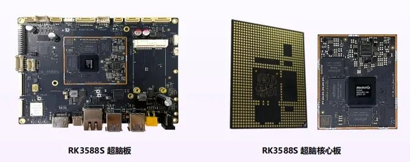

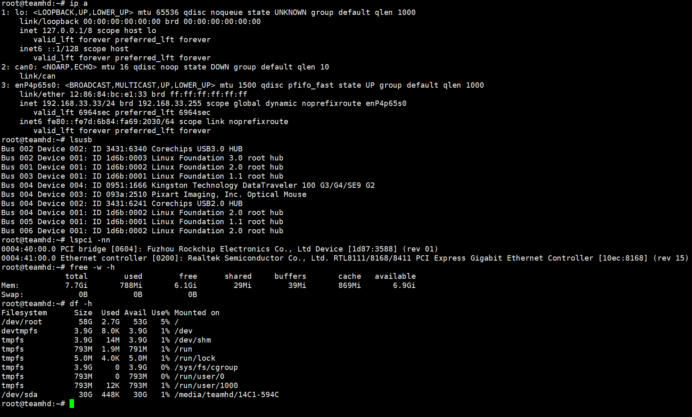

---

## debug线连接方式：

* 正常波特率是1500000，但部分固件设置为112500
* 如果乱码说明至少有数据，改改波特率就好了

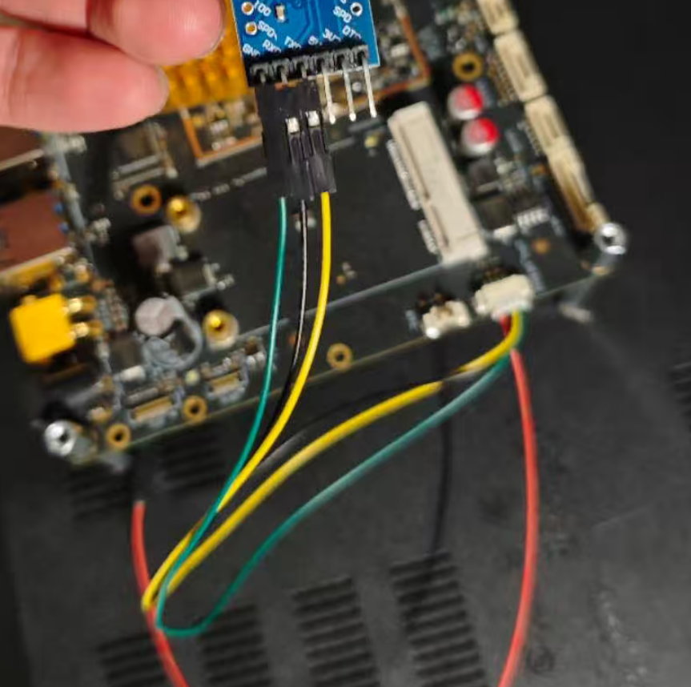

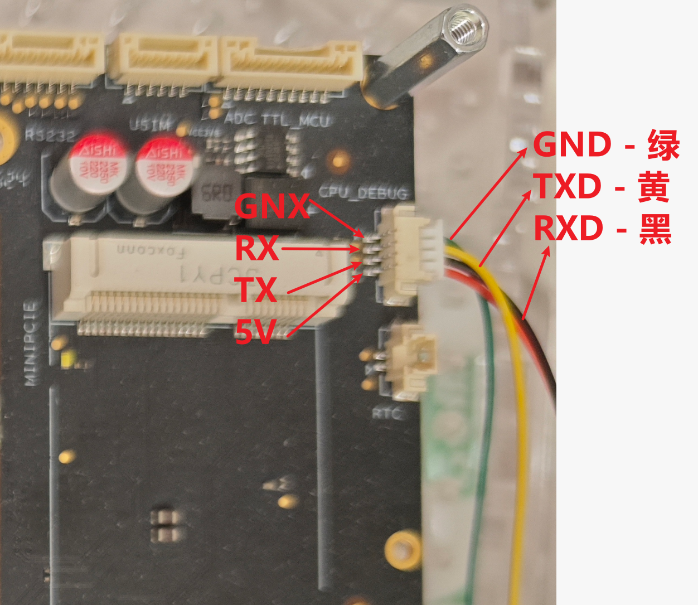

---

## 主板

* 官方文档：<https://aiui-doc.xf-yun.com/project-2/doc-145/>
* <https://aiui.xfyun.cn/solution/super-brain-core?chan=AIUI&way=menu>
* <https://aibot.xfyun.cn/softAndHard/superBrainCore>
* <https://aibot.xfyun.cn/softAndHard/superBrain>

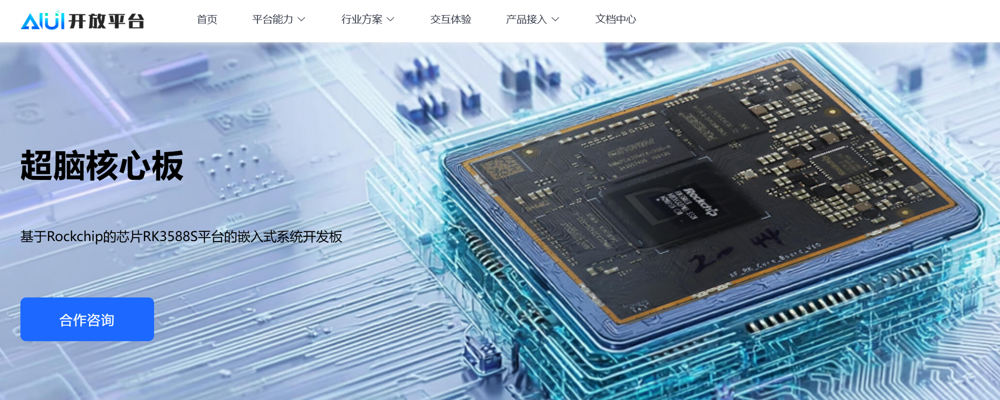

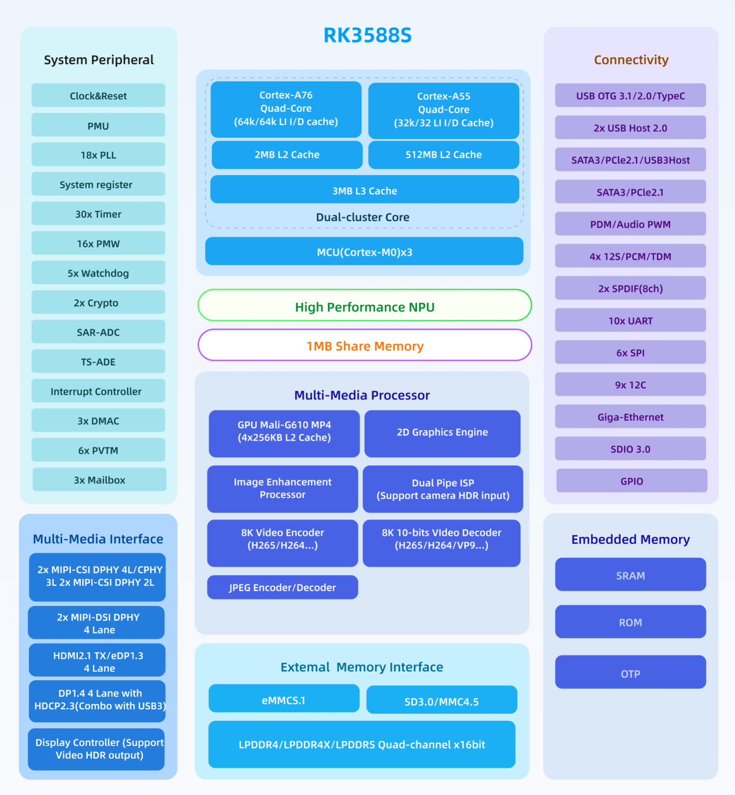

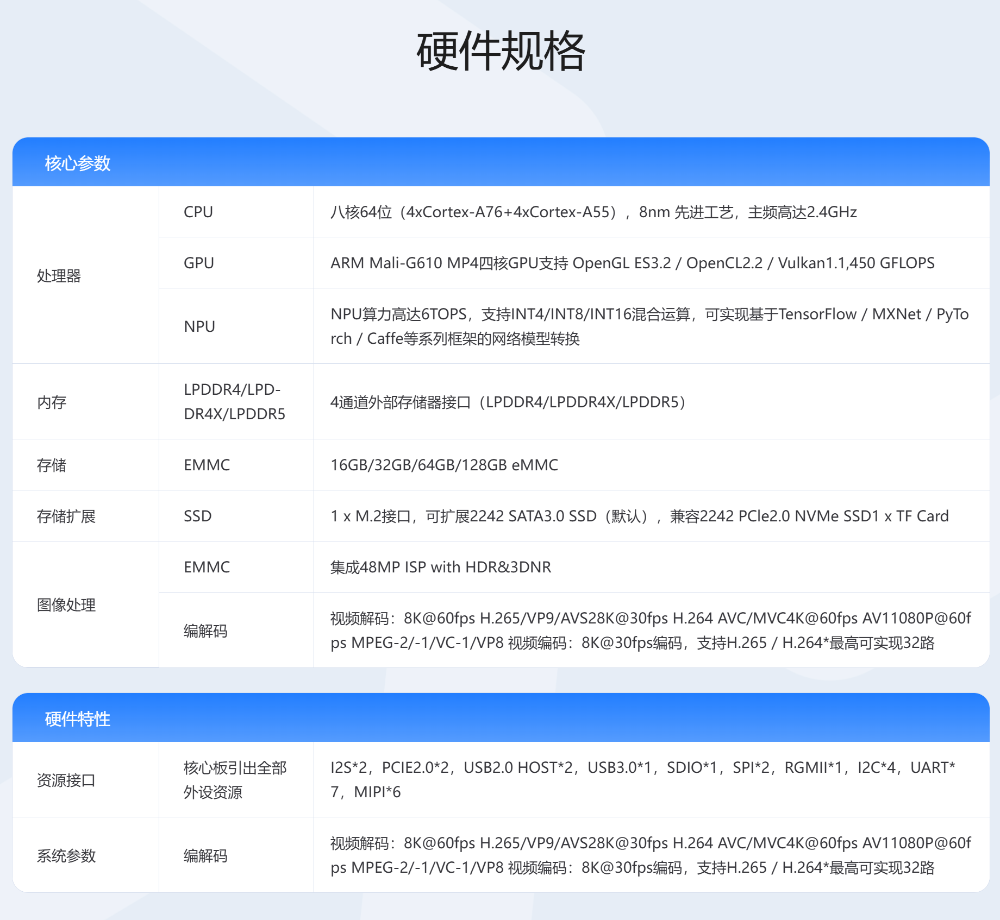

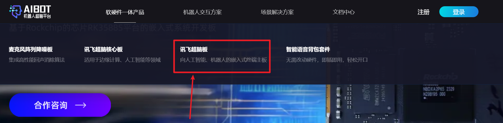

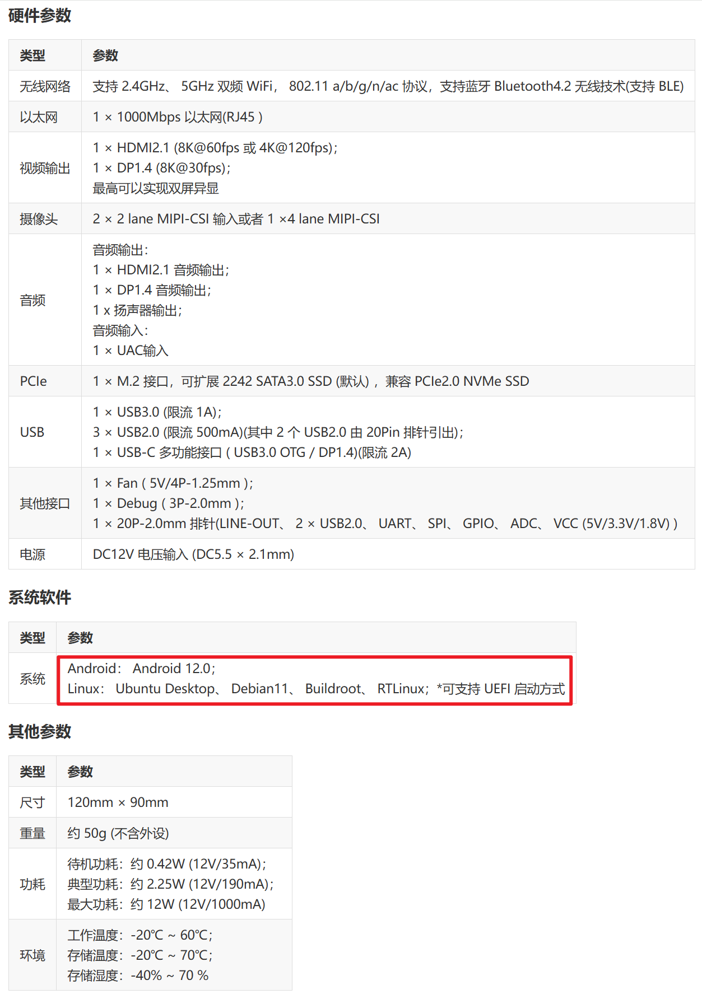

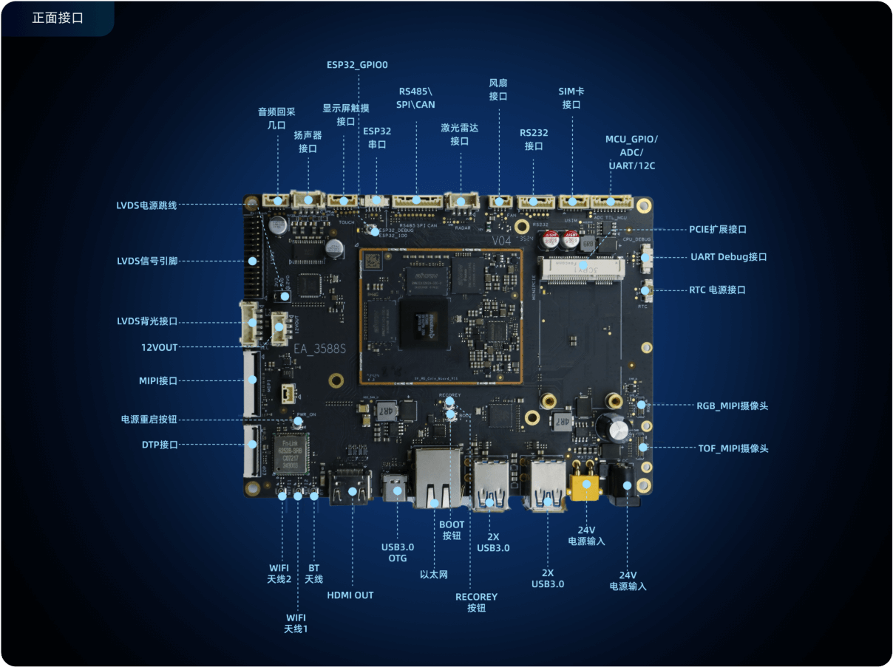

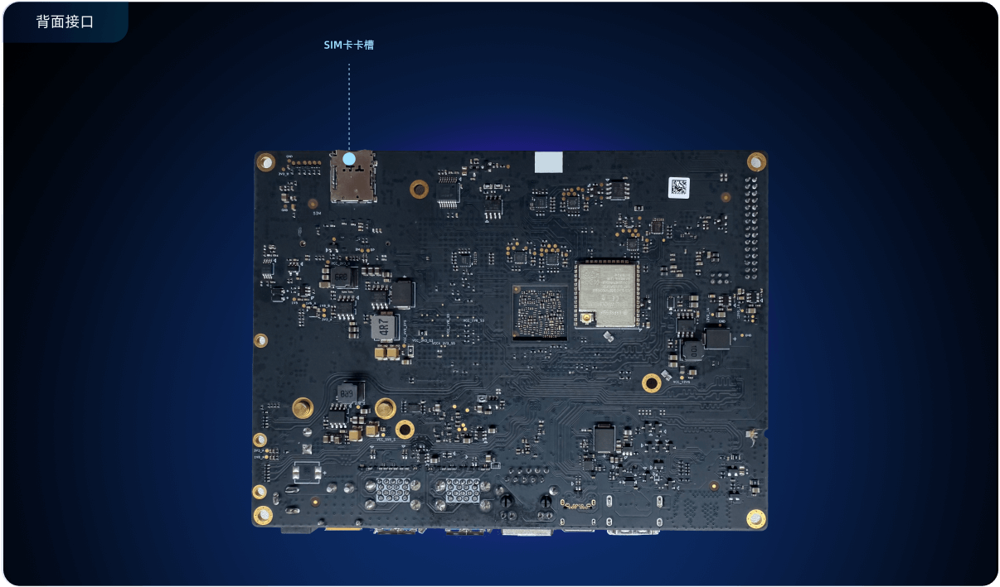

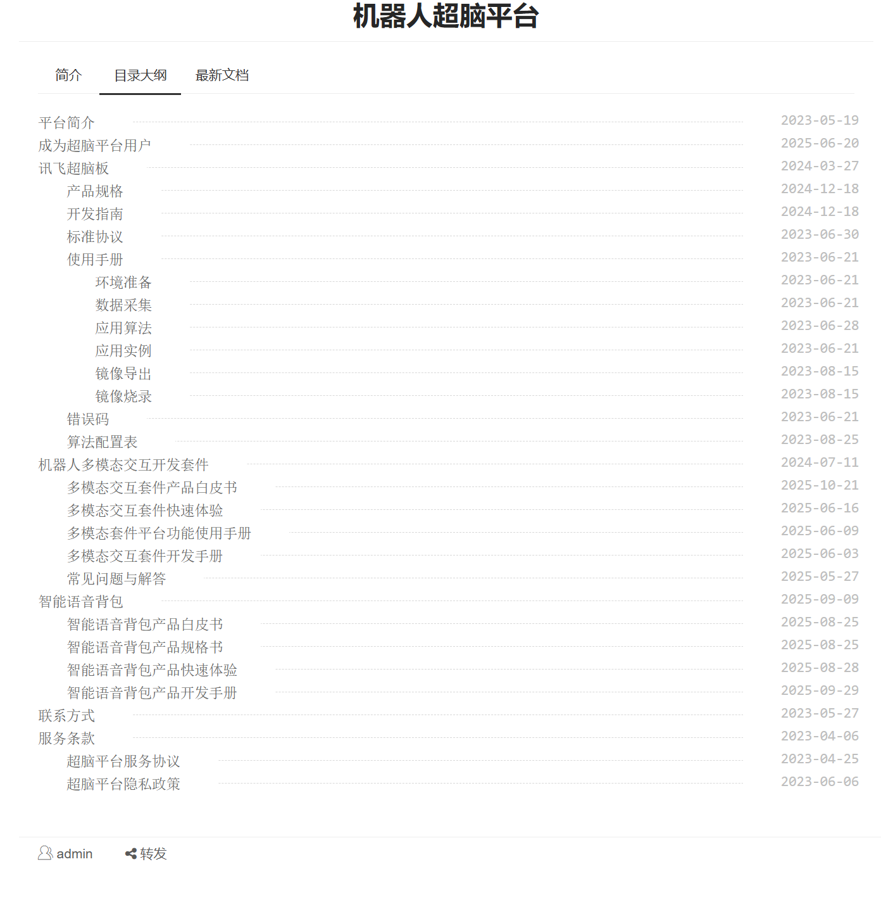

---